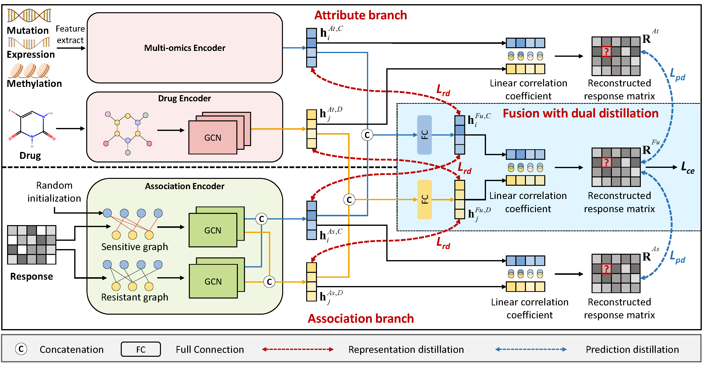

# RedCDR
Source code for ***[RedCDR: Dual Relation Distillation for Cancer Drug Response Prediction]*** published in IEEE/ACM TCBB 2024.

[RedCDR: Dual Relation Distillation for Cancer Drug Response Prediction]:https://ieeexplore.ieee.org/document/10536635



[//]: # (![image]&#40;https://github.com/mhxu1998/RedCDR/blob/main/pic/framework.png&#41;)
Requirements
----
This project was run in a conda virtual environment on Ubuntu 16.04 with CUDA 10.1. 
+ python=3.6.13
+ torch==1.8.0
+ torch-cluster==1.5.9
+ torch-geometric==2.0.3
+ torch-scatter==2.0.6
+ torch-sparse==0.6.10
+ rdkit==2020.09.1.0
+ deepchem==2.5.0
+ pubchempy==1.0.4

Data preparation
----
Please unzip the file: data/Drug/drug_graph_feat.zip first.

Model training
----
+ python main_gdsc.py  <parameters>
+ python main_ccle.py  <parameters>

Acknowledgments
----
This project is built with the reference to the following open-source projects: [GraphCDR], [NIHGCN].

[GraphCDR]:https://github.com/BioMedicalBigDataMiningLab/GraphCDR
[NIHGCN]:https://github.com/weiba/NIHGCN

Citation
----
```
@article{xu2024redcdr,
  title={RedCDR: Dual Relation Distillation for Cancer Drug Response Prediction},
  author={Xu, Muhao and Zhu, Zhenfeng and Zhao, Yawei and He, Kunlun and Huang, Qinghua and Zhao, Yao},
  journal={IEEE/ACM Transactions on Computational Biology and Bioinformatics},
  year={2024},
  volume={21},
  number={5},
  pages={1468-1479},
  doi={10.1109/TCBB.2024.3404262}
}
```
